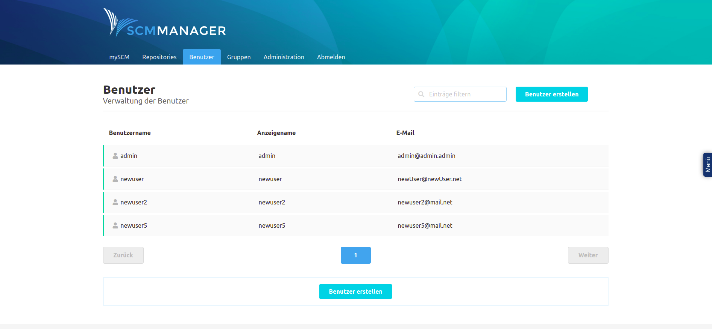
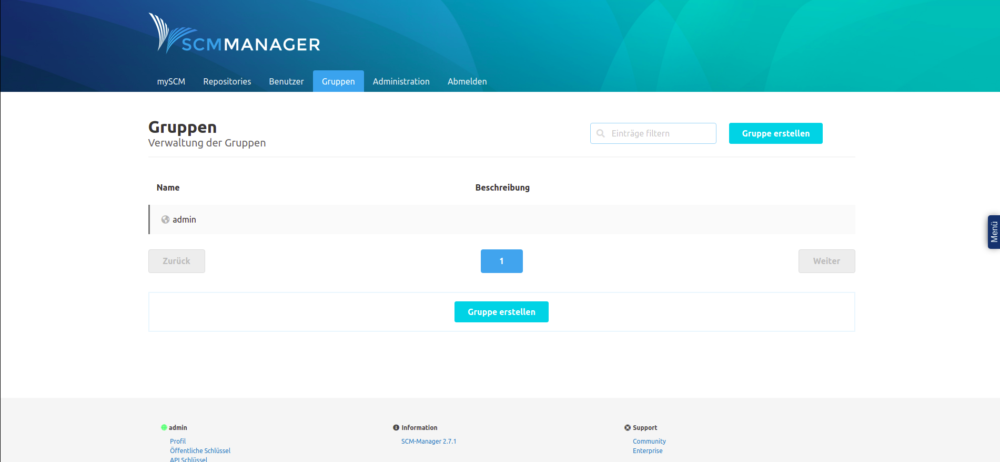
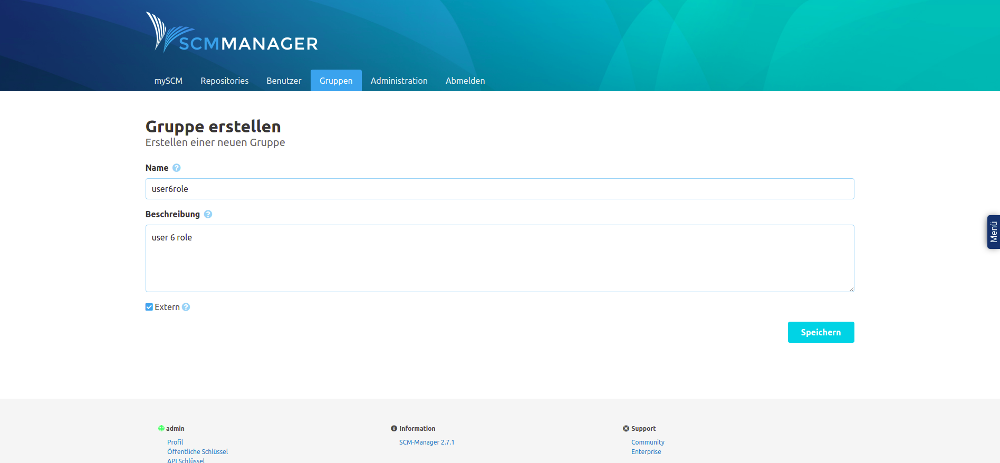
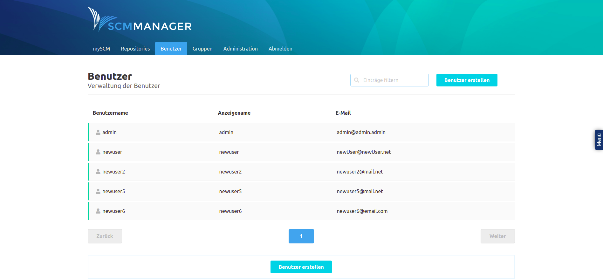
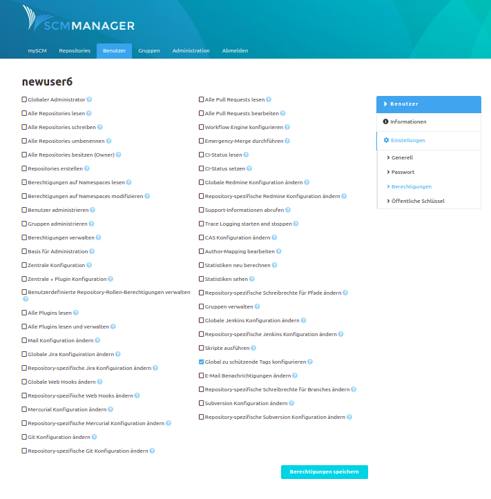
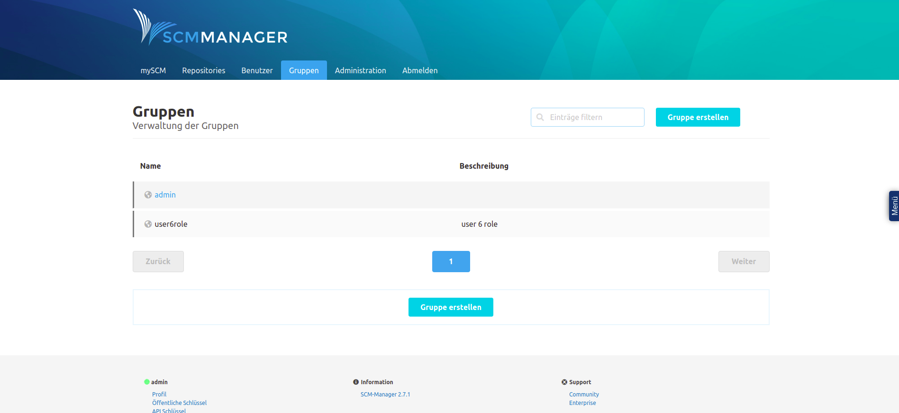
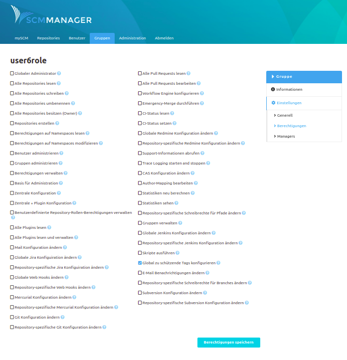
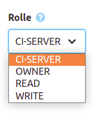
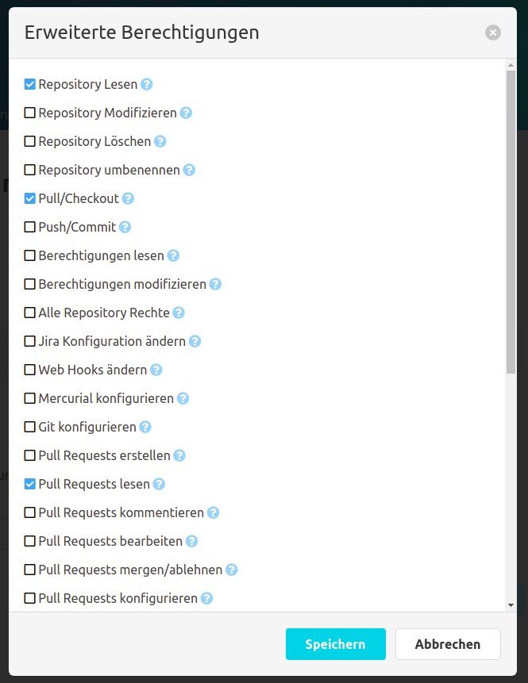

# Dokumentation

Der SCM-Manager ist ein Repository Management Tool, in dem Repositories vom Typ Git, Mercurial und Subversion über eine Weboberfläche verwaltet werden können. Über Plugins kann die Anwendung vielseitig erweitert werden.

Die offizielle Dokumentation der Applikation findet sich hier: https://scm-manager.org/docs/latest/de/

## Administrationshinweise: Nutzer und Gruppen im SCM-Manager
Im SCM-Manager existieren Nutzer und Gruppen. Die Gruppen im SCM-Manager entsprechen dabei den Gruppen eines Nutzers im User Management.
Sobald sich ein Nutzer im SCM-Manager anmeldet, wird der Nutzer ebenfalls im SCM-Manager angelegt.

### Standardzustand
Ein normaler Benutzer kann weder eigene Repositories erstellen, noch vorhandene Repositories sehen. Allerdings kann ein Administrator oder der Ersteller eines Repositories, einen Nutzer oder eine Gruppe berechtigen, ein Repository zu sehen bzw. zu bearbeiten.

Mitglieder der Gruppe "cesAdmin" sind automatisch Administratoren des SCM-Managers. Sie können alle Repositories sehen und bearbeiten, sowie alle Funktionen des SCM-Managers vollumfänglich nutzen.

### Berechtigung und Synchronisierung
Nutzer, welche sich zuvor noch nie im SCM-Manager eingeloggt haben, sind im SCM-Manager nicht vorhanden.

Da die Nutzer erst bei ihrem Login angelegt werden, können diese nicht ohne weiteres vorher berechtigt werden.
Ist aber der Name eines Nutzers aber bekannt, so kann ein Nutzer mit diesem Namen angelegt werden. Dieser muss als externer Nutzer markiert werden. Anschließend kann dieser berechtigt werden. Dasselbe gilt für Gruppen.

Sollte sich ein Nutzer, welcher aktuell noch nicht im SCM-Manager existiert, über CAS einloggen, so wird dieser im SCM-Manager angelegt.
Das gilt allerdings nicht für Gruppen. Wenn Gruppen berechtigt werden sollen, so müssen diese als externe Gruppen manuell angelegt und berechtigt werden.

Werden die Daten eines Nutzers verändert und der Nutzer loggt sich erneut ein, so werden die veränderten Daten mit denen aus dem User Management überschrieben.
Sollen die Daten eines Nutzers verändert werden, so muss dies über das User Management geschehen.

### Beispiel: Rechtevergabe
Für dieses Beispiel wurde im Vorraus der Benutzer "newuser6" mit der Gruppe "user6role" im User Management angelegt.

#### Optional: Legen Sie einen neuen Nutzer an
Dieser Schritt kann übersprungen werden, wenn der zu berechtigende Nutzer sich bereits eingeloggt hat.

Klicken Sie auf den Reiter "Benutzer" und klicken Sie anschließend auf "Benutzer erstellen".

In das Formular geben Sie nun den Namen des Nutzers ein und aktivieren Sie die Checkbox "Extern".
Wichtig: Der Benutzername des Nutzers muss exakt dem Benutzernamen des Nutzers im User Management entsprechen.

Klicken Sie dann auf "Speichern", um den Nutzer anzulegen.

Der Nutzer kann nun berechtigt werden.

#### Legen Sie die zu berechtigende Gruppe an
Da die Gruppen aus dem User Management im SCM-Manager nicht im Dogu angelegt werden, muss dieser Schritt zwangsläufig erfolgen, sofern eine Gruppe berechtigt werden soll.

Klicken Sie dafür auf den Reiter "Gruppen" und anschließend auf "Gruppe erstellen".

In das Formular geben Sie nun den Namen der Gruppe sowie eine Beschreibung ein und aktivieren Sie die Checkbox "Extern".
Wichtig: Der Name der Gruppe muss exakt dem Namen der Gruppe im User Management entsprechen.

Klicken Sie dann auf "Speichern", um die Gruppe anzulegen.

Die Gruppe kann nun berechtigt werden.

#### Generelle Berechtigung eines Nutzers im SCM-Manager
Klicken Sie auf den Reiter "Benutzer" und wählen Sie in der Liste der Benutzer den Benutzer aus, den Sie berechtigen wollen.

Anschließend klicken Sie auf "Einstellungen", dann auf "Berechtigungen".

Wählen Sie dort die Berechtigungen aus, die der Nutzer erhalten soll und klicken Sie auf "Berechtigungen speichern".

#### Generelle Berechtigung einer Gruppe im SCM-Manager
Klicken Sie auf den Reiter "Gruppen" und wählen Sie in der Liste der Gruppen die Gruppe aus, die Sie berechtigen wollen.

Anschließend klicken Sie auf "Einstellungen", dann auf "Berechtigungen". Wählen Sie dort die Berechtigungen aus, die die Gruppe erhalten soll und klicken Sie auf "Berechtigungen speichern".

Die Berechtigungen sind nun für den Nutzer wirksam.

#### Berechtigung eines Nutzers oder einer Gruppe für ein bestimmtes Repository

Rufen Sie die Seite Ihres Repositories auf, klicken Sie dort auf "Einstellungen" und anschließend auf "Berechtigungen".

Unter der Überschrift "Neue Berechtigung hinzufügen" wählen Sie entweder "Benutzerberechtigung" oder "Gruppenberechtigung" aus,
je nachdem ob die neue Berechtigung für nur einen Nutzer oder für eine Gruppe erstellt werden soll.
In das Feld "Benutzer" bzw. "Gruppe" schreiben Sie nun den Namen des zu berechtigenden Benutzers oder der Gruppe.

Nun haben Sie die Möglichkeit, dem eine eine vorgefertigte Rolle zuzuweisen, bei dem dieser ein vordefiniertes Set an Berechtigungen bekommt.
Wählen Sie dafür einen Eintrag aus der Liste "Rolle" aus.

Alternativ können Sie jede Berechtigung selbst bestimmen. Klicken Sie dafür auf die Schaltfläche "Erweitert". Es öffnet sich ein Dialog.
Dort wählen Sie die Berechtigungen aus, welche der Nutzer erhalten soll und klicken auf "Speichern".

Haben Sie alle gewünschten Berechtigungen hinzugefügt, klicken Sie auf "Speichern".
Der Nutzer bzw. die Gruppe hat nun die von Ihnen gewählten Berechtigungen für das von Ihnen gewählte Repository.

Die neuen Berechtigungen sind nun wirksam.