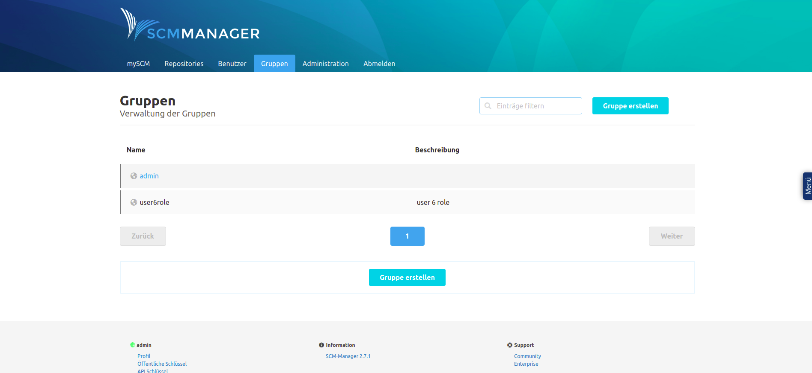
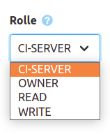

# Documentation

The SCM Manager is a repository management tool in which Git, Mercurial and Subversion type repositories can be managed via a web interface. The application can be extended in many ways via plugins.

The official documentation of the application can be found here: https://scm-manager.org/docs/latest/en/

## Administration notes: Users and groups in the SCM-Manager
In the SCM-Manager there are users and groups. The groups in the SCM-Manager correspond to the groups of a user in the User Management.
As soon as a user logs in to the SCM Manager, the user is also created in the SCM Manager.

### Default state
A normal user cannot create their own repositories, nor can they see existing repositories. However, an administrator or the creator of a repository can authorize a user or group to view or edit a repository.

Members of the "cesAdmin" group are automatically administrators of the SCM Manager. They can see and edit all repositories and fully use all functions of the SCM Manager.

### Authorization and synchronization
Users who have never logged into the SCM Manager before do not exist in the SCM Manager.

Since users are not created until they log in, they cannot easily be authorized beforehand.
However, if the name of a user is known, a user with this name can be created. This user must be marked as an external user. Afterwards this user can be authorized. The same applies to groups.

If a user who does not currently exist in the SCM Manager logs in via CAS, this user will be created in the SCM Manager.
However, this does not apply to groups. If groups are to be authorized, they must be created and authorized manually as external groups.

If a user's data is changed and the user logs in again, the changed data is overwritten with the data from User Management.
If a user's data is to be changed, this must be done via User Management.

### Example: Assignment of rights
For this example, the user "newuser6" with the group "user6role" was created in User Management in advance.

#### Optional: Create a new user
This step can be skipped if the user to be authorized has already logged in.

Click on the "Users" tab and then click on "Create user".

Now enter the name of the user into the form and activate the checkbox "External".
Important: The user name of the user must be exactly the same as the user name of the user in the User Management.

Then click on "Save" to create the user.

The user can now be authorized.

#### Create the group to be authorized
Since the groups from the User Management in the SCM Manager are not created in the Dogu, this step must necessarily take place if a group is to be authorized.

To do this, click on the "Groups" tab and then on "Create group".

Now enter the name of the group and a description into the form and activate the checkbox "External".
Important: The name of the group must exactly match the name of the group in User Management.

Then click on "Save" to create the group.

The group can now be authorized.

#### General authorization of a user in SCM-manager
Click on the "Users" tab and select the user you want to authorize from the list of users.

Then click on "Settings", then on "Permissions".

From there, select the privileges you want the user to have and click on "Save Privileges".

#### General authorization of a group in SCM-manager
Click on the "Groups" tab and select the group you want to authorize from the list of groups.

Then click on "Settings", then on "Permissions". There select the permissions you want to give to the group and click on "Save permissions".

The permissions are now effective for the user.

#### Permission of a user or group for a specific repository.

Go to your repository's page, click "Settings" there, and then click "Permissions".

Under the "Add new permission" heading, select either "User permission" or "Group permission",
depending on whether the new permission is to be created for only one user or for a group.
Now write the name of the user or group to be authorized in the "User" or "Group" field.

Now you have the possibility to assign a predefined role to the user or group, where the user or group gets a predefined set of permissions.
For this select an entry from the "Role" list.

Alternatively you can define each permission yourself. To do so, click on the "Advanced" button. A dialog opens.
There you select the permissions the user should get and click on "Save".

Once you have added all the desired permissions, click "Save".
The user or group now has the permissions you selected for the repository you selected.

The new permissions are now effective.